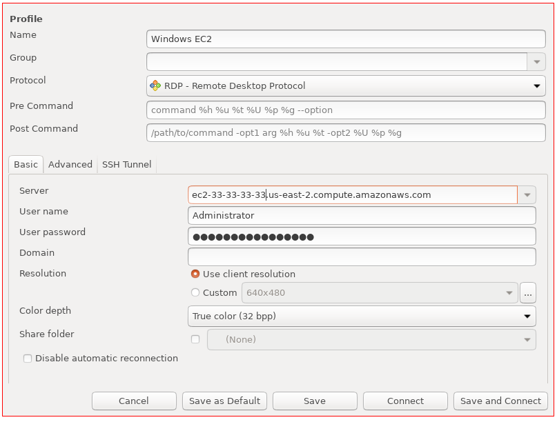
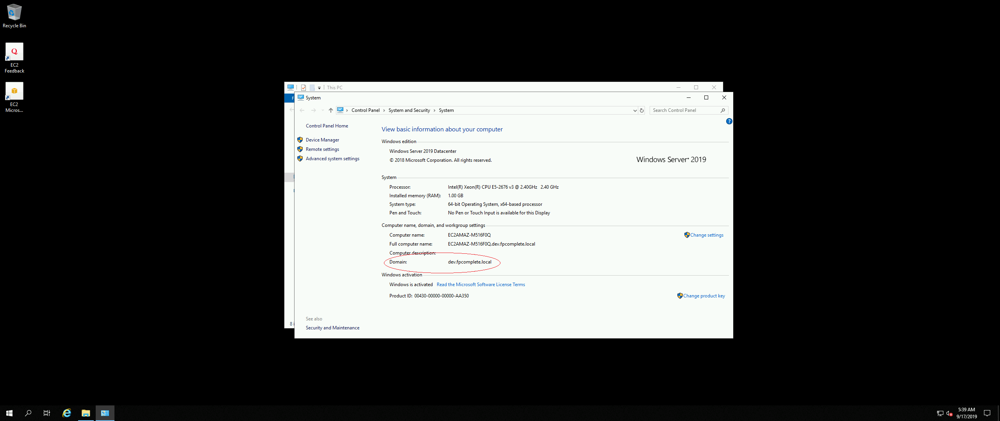

# Active Directory with seamless Windows EC2 join (from ASG)

The terraform code is built on top of
[vpc-scenario1](https://docs.aws.amazon.com/vpc/latest/userguide/VPC_Scenario1.html)
with two additional private subnets and a NAT gateway on a public
subnet. This example demonstrate how an Windows EC2 instance present
in
[ASG](https://docs.aws.amazon.com/autoscaling/ec2/userguide/AutoScalingGroup.html)
seamlessly joins an Active directory when it gets newly spawned. The
only difference between this example and the [ad-ec2](../ad-ec2) is
that this example uses ASG.

## Environment creation and deployment

To use this example set up AWS credentials and then run the commands in the 
following order:

```
make ssh-key
make init
make plan-vpc
make apply
make plan-subnets
make apply
make plan-gateway
make apply
make plan
make apply
```

## Execution

Once you run the above commands, you will get an output like this:

``` shellsession
...
module.nat-gateway.aws_route_table_association.private-rta[0]: Refreshing state... [id=rtbassoc-0be4f2c71ef12e768]
module.nat-gateway.aws_route_table_association.private-rta[1]: Refreshing state... [id=rtbassoc-08a1f878abab73841]
aws_ssm_association.associate_ssm: Refreshing state... [id=996ff9a8-0931-4000-85aa-d01ef536f5a7]


Outputs:

asg-name = test-ad-project-asg-cluster20190919093341776000000005
microsoft-ad_dns_ip_addresses = [
  "10.23.21.134",
  "10.23.22.45",
]
microsoft-ad_dns_name = dev.fpcomplete.local
```

## Testing

You need to test that the Windows EC2 instance actually joined the
Active directory. There are two ways to test it:

* RDP to your instance and verify
* RDP using Active Directory authentication

### Method 1

On a Linux client machine, something like
[remmina](https://remmina.org) can be used to RDP into your Windows
EC2 instance. You need to fill three information in the Remmina client
to successfully RDP:

* Server: You can go and find the instance IP address using the
  `asg-name` from the above output. This can be done either via AWS
  Console or use the `aws` cli tool.
* User name: Administrator
* User password: The password you used with the variable named
  `admin_password` in `variables.tf`.



Note that if you try to take the password from the AWS Console using
your SSH private key, that won't work as it has been overridden using
[bootstrap.win.txt](./bootstrap.win.txt).

Once you connect into the instance, you need to check the properties
of your machine there:



If you have a `Domain:` entry there, then that means the instance has
successfully joined the Active directory. Instead, if you have an
entry that starts with `Workgroup:` then your device is not joined to an
Active Directory.

### Method 2

In this method, you again try to RDP via the Active directory
credentials. When you create a directory with AWS Managed Microsoft
AD, it will create a directory administrator account with the user
name `Admin` and the specified password (which you supplied through
terraform). Let's again use Remmina to fill the following four
information:

* Server: You can go and find the instance IP address using the
  `asg-name` from the above output. This can be done either via AWS
  Console or use the `aws` cli tool.
* User name: Admin
* User password: The password you used with the variable named
  `active_directory_password` in `variables.tf`.
* Domain: The domain name which you passed in the `locals.tf`. For
  this example, it is `dev.fpcomplete.local`.


If it's able to successfully connect to the instance, you can confirm
that the EC2 instance has actually joined the AD. You can further verify that you have actually logged in via Active directory through the following steps:

* Start the "CMD" program.
* Type "set user".
* You will receive a output from the above command. Look at the line
  start with `USERDOMAIN:` entry. If it contains your computer's name,
  then you're logged in to the computer. If it contains the Active
  Directory's name, you're logged in to the Active Directory. In our
  case this is the output we receive which confirms that we are logged
  in via AD:

``` shellsession
C:\Users\Admin>set user
USERDNSDOMAIN=DEV.FPCOMPLETE.LOCAL
USERDOMAIN=dev
USERDOMAIN_ROAMINGPROFILE=dev
USERNAME=Admin
USERPROFILE=C:\Users\Admin
```

## Destruction

To destroy the test environment run the following commands:

```
$ make destroy
$ make clean
```

## Debugging

The script execution using `user_data` is usually hard to debug. In
our [bootstrap script](./bootstrap.win.txt), we use
[Start-Transcript](https://docs.microsoft.com/en-us/powershell/module/microsoft.powershell.host/start-transcript?view=powershell-6)
to create a record of the powershell session to a text file. For the
above launched instances, it is present in the following location:

```
C:\Users\Administrators\Documents
```

## Reference

* [AWS docs on AWS Managed Microsoft AD](https://docs.aws.amazon.com/directoryservice/latest/admin-guide/ms_ad_getting_started.html)
* [AWS docs on Joining an EC2 instance](https://docs.aws.amazon.com/directoryservice/latest/admin-guide/ms_ad_join_instance.html)
* [AWS docs on Systems manager and AD](https://aws.amazon.com/premiumsupport/knowledge-center/ec2-systems-manager-dx-domain/)
